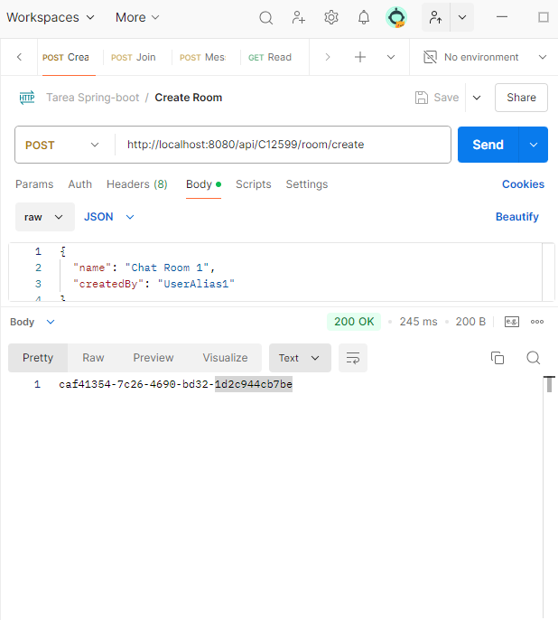
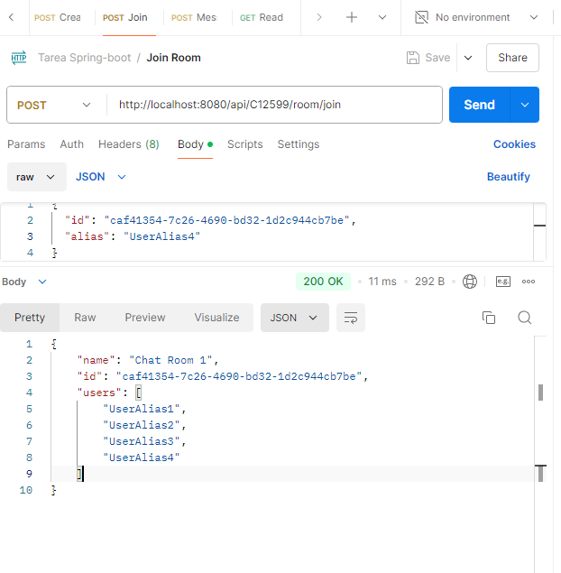
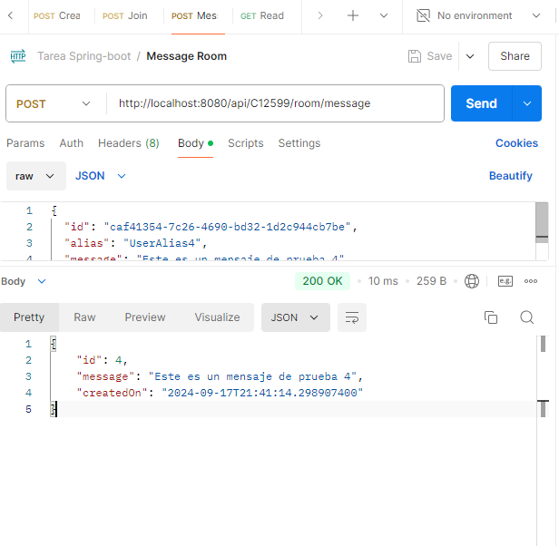

# Pruebas del API de Conversaciones Anónimas

## Introducción

Este documento proporciona detalles sobre las pruebas realizadas para la API de Conversaciones Anónimas desarrollada como parte de la tarea de Spring Boot. Las pruebas se llevaron a cabo utilizando Postman para asegurar el correcto funcionamiento de los endpoints de la API.

## Endpoints y Pruebas Realizadas

### 1. Crear una Sala

- **URL:** `/api/{carnet}/room/create`
- **Método:** `POST`
- **Payload de Ejemplo:**
  ```json
  {
    "name": "Sala de Prueba",
    "createdBy": "UsuarioTest"
  }
  ```
- **Respuesta Esperada:**
  ```json
  {
    "id": "id_de_sala_generado"
  }
  ```
- **Captura de Pantalla de la Prueba:**
  
  

### 2. Registrar Usuario en una Sala Existente

- **URL:** `/api/{carnet}/room/join`
- **Método:** `POST`
- **Payload de Ejemplo:**
  ```json
  {
    "id": "id_de_sala_generado",
    "alias": "UsuarioNuevo"
  }
  ```
- **Respuesta Esperada:**
  ```json
  {
    "id": "id_de_sala_generado",
    "name": "Sala de Prueba",
    "users": ["UsuarioTest", "UsuarioNuevo"]
  }
  ```
- **Captura de Pantalla de la Prueba:**
  
  

### 3. Enviar Mensaje a la Sala

- **URL:** `/api/{carnet}/room/message`
- **Método:** `POST`
- **Payload de Ejemplo:**
  ```json
  {
    "id": "id_de_sala_generado",
    "alias": "UsuarioNuevo",
    "message": "Hola a todos!"
  }
  ```
- **Respuesta Esperada:**
  ```json
  {
    "id": "id_del_mensaje_generado",
    "createdOn": "fecha_y_hora_iso8601",
    "message": "Hola a todos!"
  }
  ```
- **Captura de Pantalla de la Prueba:**
  
  

### 4. Leer Todos los Mensajes en Orden Cronológico

- **URL:** `/api/{carnet}/room/messages`
- **Método:** `GET`
- **Parámetros de Consulta (Query Params):**
  - `roomId`: ID de la sala cuyos mensajes se desean leer.
  
- **Respuesta Esperada:**
  ```json
  {
    "id": "id_de_sala_generado",
    "name": "Sala de Prueba",
    "messages": [
      {
        "alias": "UsuarioTest",
        "message": "Mensaje inicial",
        "createdOn": "fecha_y_hora_iso8601"
      },
      {
        "alias": "UsuarioNuevo",
        "message": "Hola a todos!",
        "createdOn": "fecha_y_hora_iso8601"
      }
    ]
  }
  ```
- **Captura de Pantalla de la Prueba:**
  
  

## Script de Pruebas (Postman)

El siguiente script JSON describe las pruebas realizadas en Postman para verificar el funcionamiento de los endpoints:

```json
{
  "info": {
    "_postman_id": "05fd4692-1d73-4756-9eba-644f83ad3721",
    "name": "Tarea Spring-boot",
    "schema": "https://schema.getpostman.com/json/collection/v2.1.0/collection.json",
    "_exporter_id": "34115067"
  },
  "item": [
    {
      "name": "Create Room",
      "request": {
        "method": "POST",
        "body": {
          "mode": "raw",
          "raw": "{\r\n  \"name\": \"Sala de Prueba\",\r\n  \"createdBy\": \"UsuarioTest\"\r\n}",
          "options": {
            "raw": {
              "language": "json"
            }
          }
        },
        "url": {
          "raw": "http://localhost:8080/api/C12599/room/create",
          "protocol": "http",
          "host": ["localhost"],
          "port": "8080",
          "path": ["api", "C12599", "room", "create"]
        }
      }
    },
    {
      "name": "Join Room",
      "request": {
        "method": "POST",
        "body": {
          "mode": "raw",
          "raw": "{\r\n  \"id\": \"caf41354-7c26-4690-bd32-1d2c944cb7be\",\r\n  \"alias\": \"UsuarioNuevo\"\r\n}",
          "options": {
            "raw": {
              "language": "json"
            }
          }
        },
        "url": {
          "raw": "http://localhost:8080/api/C12599/room/join",
          "protocol": "http",
          "host": ["localhost"],
          "port": "8080",
          "path": ["api", "C12599", "room", "join"]
        }
      }
    },
    {
      "name": "Message Room",
      "request": {
        "method": "POST",
        "body": {
          "mode": "raw",
          "raw": "{\r\n  \"id\": \"caf41354-7c26-4690-bd32-1d2c944cb7be\",\r\n  \"alias\": \"UsuarioNuevo\",\r\n  \"message\": \"Hola a todos!\"\r\n}",
          "options": {
            "raw": {
              "language": "json"
            }
          }
        },
        "url": {
          "raw": "http://localhost:8080/api/C12599/room/message",
          "protocol": "http",
          "host": ["localhost"],
          "port": "8080",
          "path": ["api", "C12599", "room", "message"]
        }
      }
    },
    {
      "name": "Read Message",
      "request": {
        "method": "GET",
        "url": {
          "raw": "http://localhost:8080/api/C12599/room/messages?roomId=caf41354-7c26-4690-bd32-1d2c944cb7be",
          "protocol": "http",
          "host": ["localhost"],
          "port": "8080",
          "path": ["api", "C12599", "room", "messages"],
          "query": [
            {
              "key": "roomId",
              "value": "caf41354-7c26-4690-bd32-1d2c944cb7be"
            }
          ]
        }
      }
    }
  ]
}
```

## Entrega

El directorio `pruebas` incluye:
- Capturas de pantalla de las pruebas realizadas en Postman para cada endpoint.
- El script de pruebas se proporciona en formato JSON para ser importado y ejecutado en Postman.
